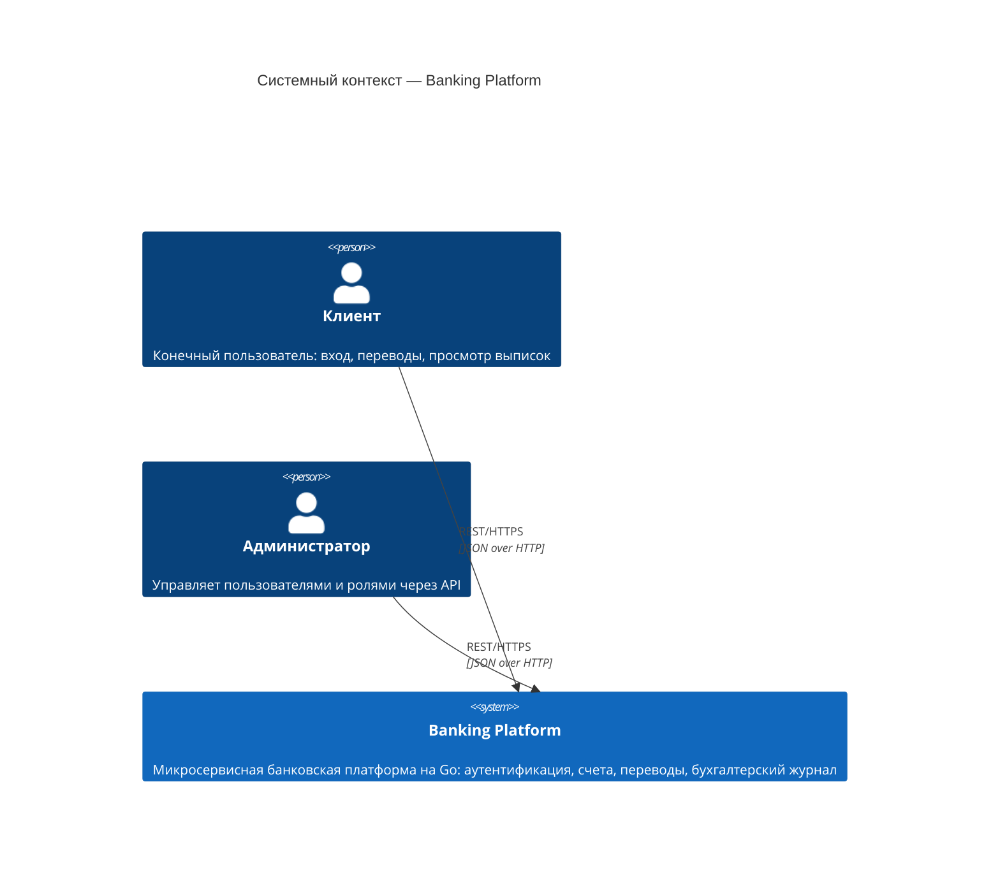
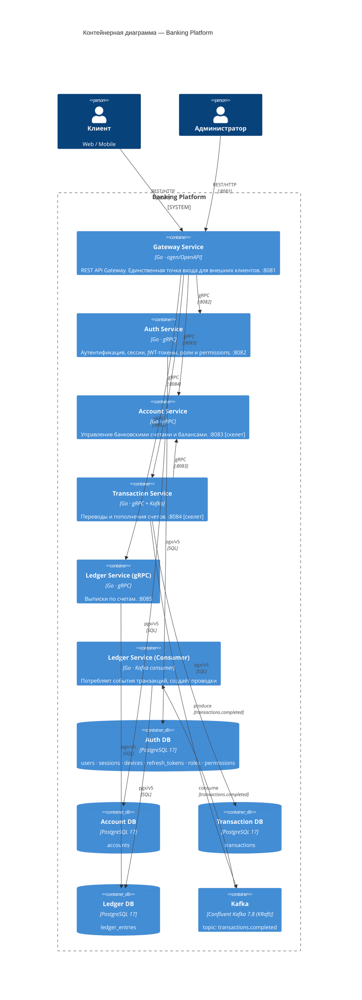
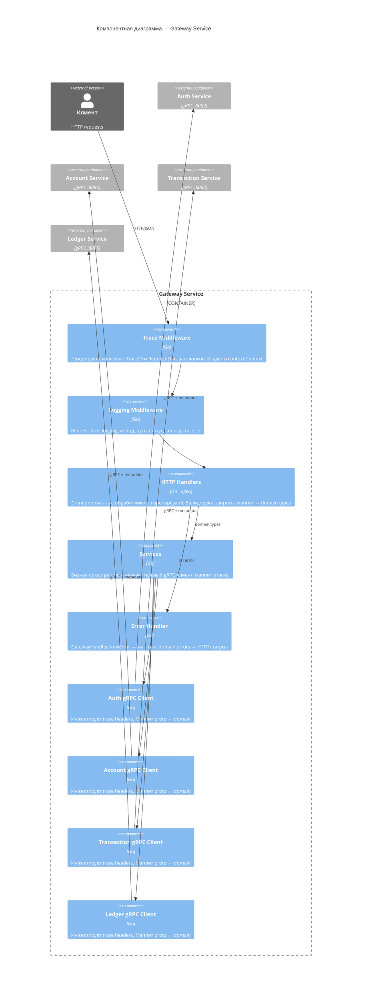
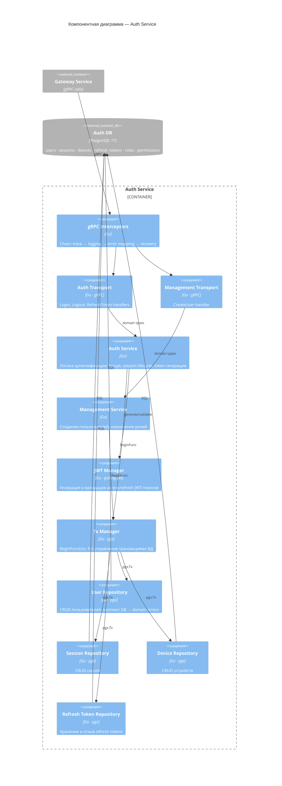

[← Архитектура](architecture.md) · [Back to README](../README.md) · [Sequence Diagrams →](diagrams.md)

# C4 Диаграммы

C4 Model — иерархия из четырёх уровней абстракции: Context → Container → Component → Code. Диаграммы ниже охватывают первые три уровня.

---

## Уровень 1 — System Context

Кто взаимодействует с системой и какую роль она выполняет в более широкой среде.

---

## Уровень 2 — Containers

Какие исполняемые единицы входят в систему, как они общаются и где хранят данные.

---

## Уровень 3 — Components: Gateway Service

Из каких компонентов состоит `gateway-service` — самый сложный сервис с fan-out к остальным.

---

## Уровень 3 — Components: Auth Service

Внутренняя структура `auth-service` — наиболее полностью реализованного сервиса.

## See Also

- [Архитектура](architecture.md) — паттерны и правила зависимостей
- [Sequence Diagrams](diagrams.md) — потоки выполнения ключевых use cases
- [Развёртывание](deployment.md) — как всё запускается
