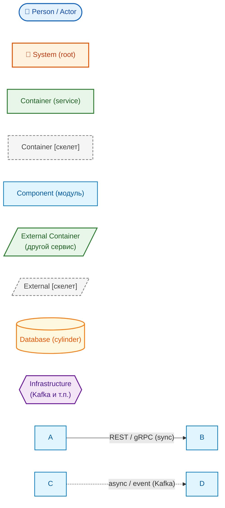
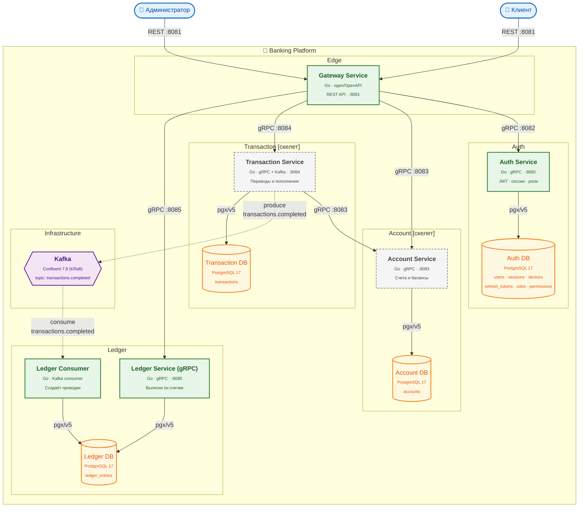
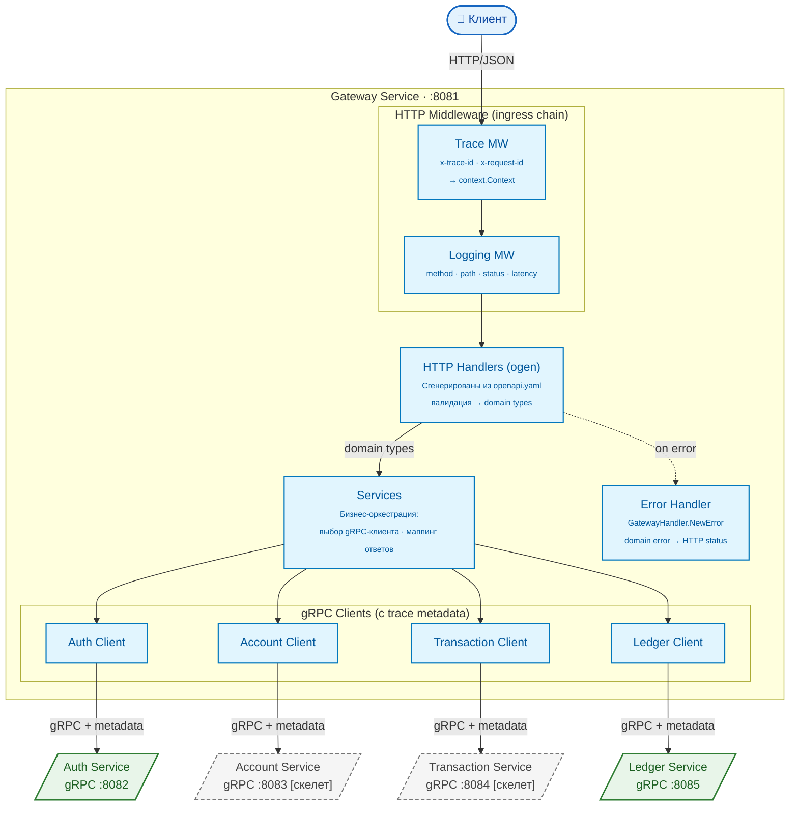
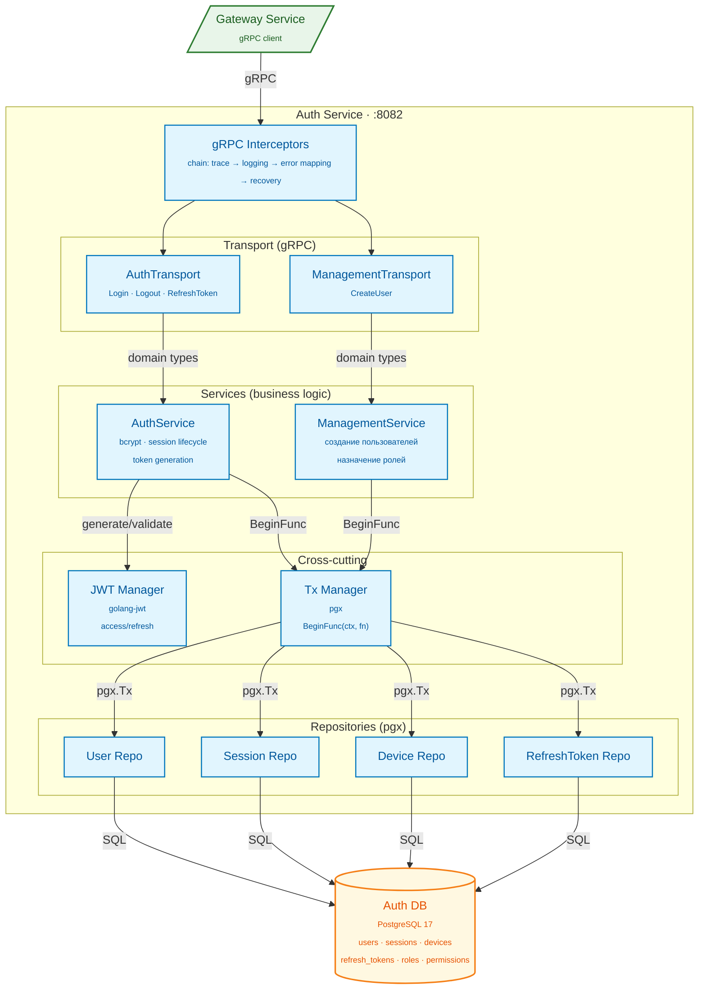
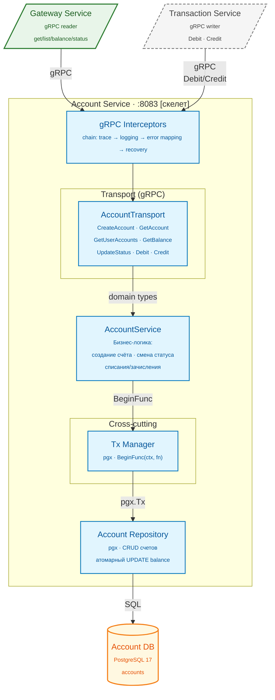
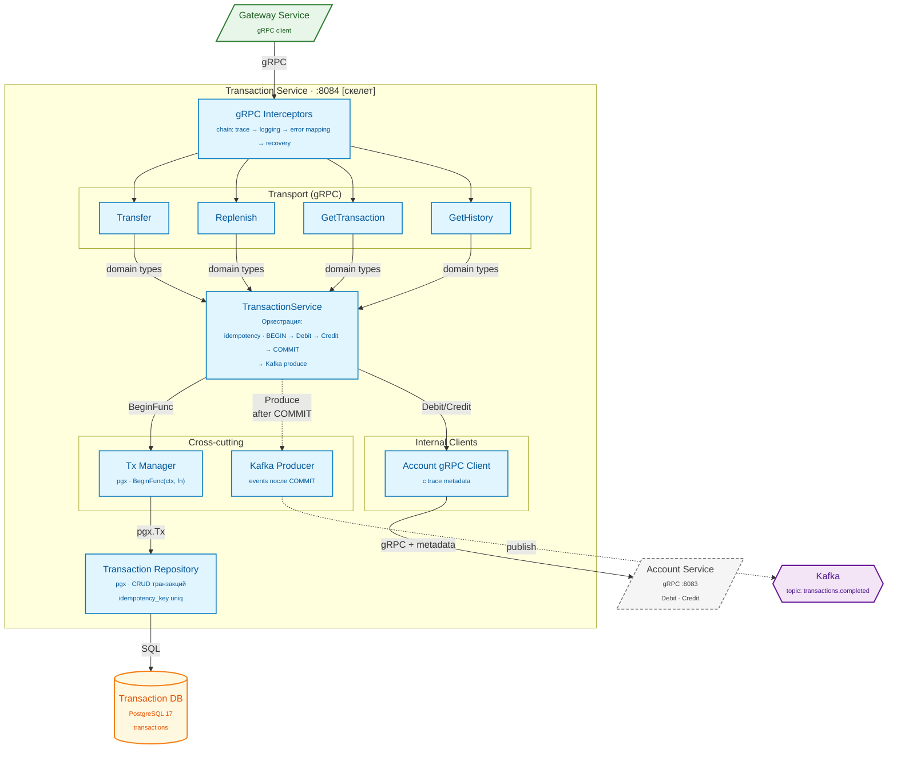
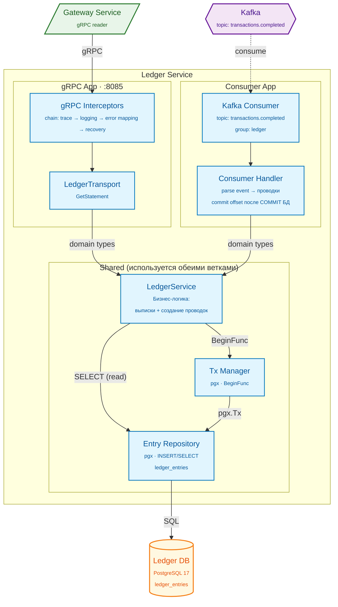

[← Архитектура](architecture.md) · [Back to README](../README.md) · [Sequence Diagrams →](diagrams.md)

# C4 Диаграммы

C4 Model — иерархия из четырёх уровней абстракции: Context → Container → Component → Code. Диаграммы ниже охватывают первые три уровня.

Все диаграммы выполнены на `mermaid flowchart` с единым визуальным языком. Канонический синтаксис `C4Context / C4Container / C4Component` сознательно не используется: его рендерер в GitHub Markdown даёт скученный layout и пересечения связей. Семантика C4 сохраняется через `subgraph` и согласованные `classDef`.

## Содержание

- [Легенда нотации](#легенда-нотации)
- [Уровень 1 — System Context](#уровень-1--system-context)
- [Уровень 2 — Containers](#уровень-2--containers)
- [Уровень 3 — Components: Gateway Service](#уровень-3--components-gateway-service)
- [Уровень 3 — Components: Auth Service](#уровень-3--components-auth-service)
- [Уровень 3 — Components: Account Service `[скелет]`](#уровень-3--components-account-service-скелет)
- [Уровень 3 — Components: Transaction Service `[скелет]`](#уровень-3--components-transaction-service-скелет)
- [Уровень 3 — Components: Ledger Service (gRPC + Consumer)](#уровень-3--components-ledger-service-grpc--consumer)

---

## Легенда нотации

Цветовая палитра и формы узлов одинаковы во всех диаграммах ниже — это позволяет читать диаграммы по визуальному коду, не вдаваясь в подписи.

| Класс | Цвет | Когда применяется |
|---|---|---|
| `person` | синий (round shape) | Конечные пользователи и операторы (внешние акторы). |
| `system` | оранжевый | Корневая система (Banking Platform) — только на Level 1. |
| `container` | зелёный | Реализованный исполняемый юнит (сервис, БД, broker). |
| `skeleton` | серый, пунктирная рамка | Сервис со структурой кода, но без бизнес-логики (`[скелет]`). |
| `component` | голубой | Модуль внутри сервиса на Level 3. |
| `external` | зелёный (parallelogram) | Внешний сервис, на который ссылается текущая диаграмма Level 3. |
| `skeletonExt` | серый пунктир (parallelogram) | То же, но для скелетных сервисов. |
| `database` | жёлтый цилиндр | PostgreSQL-инстанс. |
| `infra` | фиолетовый hex | Инфраструктура (Kafka). |

**Стрелки:**

- `-->` сплошная — синхронный вызов (REST, gRPC, SQL).
- `-.->`  пунктирная — асинхронный путь (Kafka produce/consume), а также путь «on error» внутри компонента.

---

## Уровень 1 — System Context

Кто взаимодействует с системой и какую роль она выполняет в более широкой среде.

**Чтение:** клиент и администратор — внешние пользователи; они обращаются к платформе только через REST API (gateway-service на `:8081`). Внутреннее устройство платформы раскрывается на следующем уровне.

---

## Уровень 2 — Containers

Какие исполняемые единицы входят в систему, как они общаются и где хранят данные.

**Чтение:**

- **Edge** — единственная точка входа (gateway). Все REST-запросы идут только сюда.
- **Auth / Account / Transaction / Ledger** — четыре доменных сервиса, каждый со своей БД (database-per-service).
- **`[скелет]`** на блоках означает, что код есть как структура (`internal/<service>/`), но бизнес-логика ещё не реализована.
- **Сплошные стрелки** — синхронный вызов (REST/gRPC). **Пунктирные** — асинхронные сообщения через Kafka.
- **gateway → transaction → account** — единственный кросс-доменный gRPC-вызов на уровне платформы (нужен для атомарного списания/зачисления в переводах).

---

## Уровень 3 — Components: Gateway Service

Из каких компонентов состоит `gateway-service` — самый сложный сервис с fan-out к остальным.

**Чтение:**

- HTTP-запрос идёт через цепочку middleware `Trace → Logging → Handlers (ogen)`.
- Handlers вызывают внутренние Services, которые оркестрируют выбор нужного gRPC-клиента.
- Все 4 gRPC-клиента (`authClient`, `accountClient`, `txClient`, `ledgerClient`) инжектируют `x-trace-id` / `x-request-id` в metadata — это даёт сквозную трассировку.
- Ошибки уходят через `Error Handler` (пунктирная стрелка), который маппит domain-ошибки в HTTP статусы.

---

## Уровень 3 — Components: Auth Service

Внутренняя структура `auth-service` — наиболее полностью реализованного сервиса.

**Чтение:**

- Входящий gRPC проходит цепочку interceptors (`trace → logging → error mapping → recovery`), затем попадает в один из двух транспортов.
- `AuthTransport` обслуживает `Login / Logout / RefreshToken`, `ManagementTransport` — `CreateUser`.
- Многошаговые записи (Login, RefreshToken, CreateUser) проходят через `Tx Manager.BeginFunc(ctx, fn)` — единая транзакционная граница.
- Репозитории не логируют и сами не открывают транзакции: они получают `pgx.Tx` от `Tx Manager`-а и выполняют SQL.

---

## Уровень 3 — Components: Account Service `[скелет]`

Структура `account-service` — целевой облик. Код-скелет уже отражает эту топологию (`internal/account-service/internal/...`).

**Чтение:**

- У сервиса **два класса клиентов**: gateway (read-only выборки + создание/смена статуса) и transaction-service (внутренние списания/зачисления).
- Атомарное изменение баланса всегда идёт через `Tx Manager.BeginFunc` — даже для одношагового `UPDATE`, чтобы сохранить транзакционные инварианты при будущих расширениях (несколько проводок в одном вызове).
- Один репозиторий `Account Repository` — модель счёта плоская: `accounts(id, user_id, balance, currency, status, ...)`.

---

## Уровень 3 — Components: Transaction Service `[скелет]`

`transaction-service` оркестрирует переводы и пополнения: пишет в свою БД, дёргает `account-service` по gRPC, публикует событие в Kafka. Код-скелет в `internal/transaction-service/internal/...`.

**Чтение:**

- Точка идемпотентности — `idempotency_key` в `transactions`: повторный `Transfer/Replenish` с тем же ключом возвращает существующую запись, а не дублирует движения.
- Транзакционная граница (`BeginFunc`) охватывает: `INSERT transaction → Debit → Credit → UPDATE status='completed'`. Kafka produce **выполняется после COMMIT** — это «outbox-light» без отдельной таблицы (приемлемо, пока консьюмер идемпотентен).
- `Account gRPC Client` живёт внутри transaction-service — это единственный кросс-сервисный синхронный вызов на уровне доменной логики платформы.

---

## Уровень 3 — Components: Ledger Service (gRPC + Consumer)

`ledger-service` поднимается как **два независимых application-ядра** (см. `internal/ledger-service/internal/app/{grpc,consumer}`), но обе ветки делят бизнес-логику и одну БД.

**Чтение:**

- **gRPC ветка** — только чтение (`GetStatement`). Никаких записей через REST не предусмотрено.
- **Consumer ветка** — единственный источник записей в `ledger_entries`. Это сохраняет журнал как «append-only audit log» и исключает гонки с REST-записью.
- Обе ветки используют один и тот же `LedgerService` и `Entry Repository`, поэтому не нужно вводить отдельный application-сервис.
- `commit offset` Kafka происходит **после** успешного `COMMIT` БД — это даёт at-least-once и в сочетании с идемпотентностью consumer'а (по `transaction_id`) обеспечивает корректность журнала.

## See Also

- [Легенда нотации](#легенда-нотации) — палитра и формы узлов, единый визуальный язык всех диаграмм выше
- [Архитектура](architecture.md) — паттерны и правила зависимостей
- [Sequence Diagrams](diagrams.md) — потоки выполнения ключевых use cases
- [Развёртывание](deployment.md) — как всё запускается
