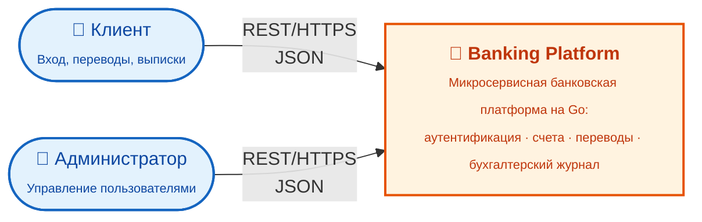
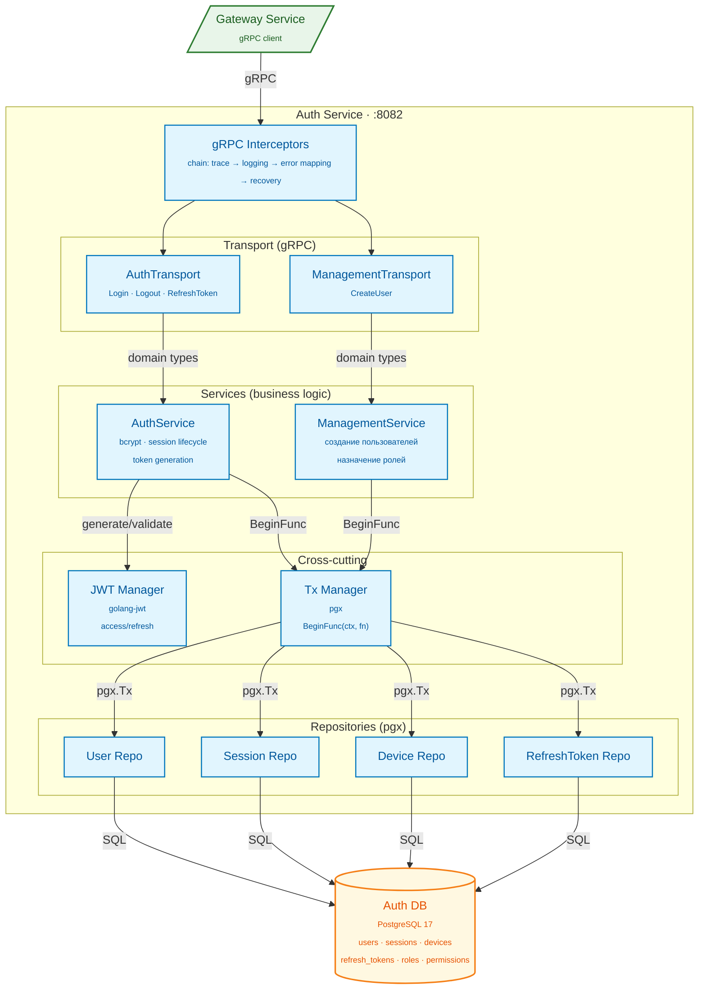

[← Архитектура](architecture.md) · [Back to README](../README.md) · [Sequence Diagrams →](diagrams.md)

# C4 Диаграммы

C4 Model — иерархия из четырёх уровней абстракции: Context → Container → Component → Code. Диаграммы ниже охватывают первые три уровня.

---

## Уровень 1 — System Context

Кто взаимодействует с системой и какую роль она выполняет в более широкой среде.

**Чтение:** клиент и администратор — внешние пользователи; они обращаются к платформе только через REST API (gateway-service на `:8081`). Внутреннее устройство платформы раскрывается на следующем уровне.

---

## Уровень 2 — Containers

Какие исполняемые единицы входят в систему, как они общаются и где хранят данные.

**Чтение:**

- **Edge** — единственная точка входа (gateway). Все REST-запросы идут только сюда.
- **Auth / Account / Transaction / Ledger** — четыре доменных сервиса, каждый со своей БД (database-per-service).
- **`[скелет]`** на блоках означает, что код есть как структура (`internal/<service>/`), но бизнес-логика ещё не реализована.
- **Сплошные стрелки** — синхронный вызов (REST/gRPC). **Пунктирные** — асинхронные сообщения через Kafka.
- **gateway → transaction → account** — единственный кросс-доменный gRPC-вызов на уровне платформы (нужен для атомарного списания/зачисления в переводах).

---

## Уровень 3 — Components: Gateway Service

Из каких компонентов состоит `gateway-service` — самый сложный сервис с fan-out к остальным.

**Чтение:**

- HTTP-запрос идёт через цепочку middleware `Trace → Logging → Handlers (ogen)`.
- Handlers вызывают внутренние Services, которые оркестрируют выбор нужного gRPC-клиента.
- Все 4 gRPC-клиента (`authClient`, `accountClient`, `txClient`, `ledgerClient`) инжектируют `x-trace-id` / `x-request-id` в metadata — это даёт сквозную трассировку.
- Ошибки уходят через `Error Handler` (пунктирная стрелка), который маппит domain-ошибки в HTTP статусы.

---

## Уровень 3 — Components: Auth Service

Внутренняя структура `auth-service` — наиболее полностью реализованного сервиса.

**Чтение:**

- Входящий gRPC проходит цепочку interceptors (`trace → logging → error mapping → recovery`), затем попадает в один из двух транспортов.
- `AuthTransport` обслуживает `Login / Logout / RefreshToken`, `ManagementTransport` — `CreateUser`.
- Многошаговые записи (Login, RefreshToken, CreateUser) проходят через `Tx Manager.BeginFunc(ctx, fn)` — единая транзакционная граница.
- Репозитории не логируют и сами не открывают транзакции: они получают `pgx.Tx` от `Tx Manager`-а и выполняют SQL.

## See Also

- [Архитектура](architecture.md) — паттерны и правила зависимостей
- [Sequence Diagrams](diagrams.md) — потоки выполнения ключевых use cases
- [Развёртывание](deployment.md) — как всё запускается
