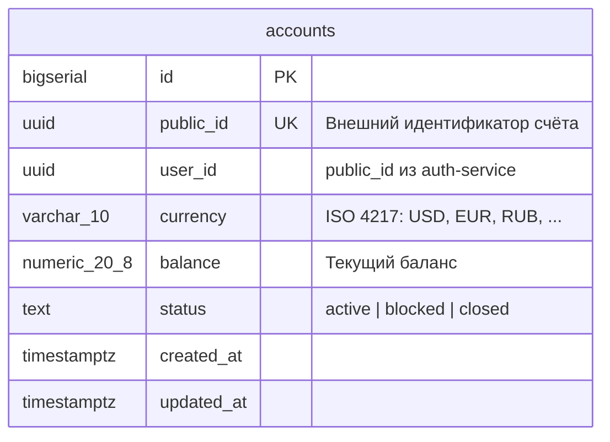

[← Sequence Diagrams](diagrams.md) · [Back to README](../README.md) · [Развёртывание →](deployment.md)

# База данных

Каждый сервис владеет своей изолированной базой данных — паттерн Database per Service. Сервисы не имеют прямого доступа к БД друг друга; обмен данными только через gRPC и Kafka.

Миграции управляются через [goose](https://github.com/pressly/goose). Файлы миграций: `internal/<service>/migrations/`.

---

## Auth DB

**Сервис:** `auth-service` · **БД:** `app_db` · **Порт:** `5432` (локально) / `5432` (Docker)

Хранит пользователей, сессии, устройства, refresh-токены, роли и права доступа.

```mermaid
erDiagram
    users {
        bigserial   id              PK
        uuid        public_id       UK  "Внешний идентификатор"
        text        login           UK  "Логин для аутентификации"
        text        email           UK
        text        phone           UK
        text        password_hash
        text        status              "active | blocked | locked | disabled"
        integer     failed_login_attempts
        timestamptz locked_until    NULL
        timestamptz created_at
        timestamptz updated_at
    }

    devices {
        bigserial   id              PK
        uuid        public_id       UK
        text        platform
        text        user_agent
        timestamptz created_at
        timestamptz updated_at
    }

    sessions {
        bigserial   id              PK
        uuid        public_id       UK
        bigint      user_id         FK
        bigint      device_id       FK
        text        status              "active | closed | expired"
        timestamptz expires_at
        timestamptz last_seen_at
        timestamptz created_at
        timestamptz updated_at
    }

    refresh_tokens {
        bigserial   id              PK
        bigint      session_id      FK
        text        token_hash
        timestamptz expires_at
        timestamptz revoked_at      NULL
        timestamptz created_at
    }

    roles {
        bigserial   id              PK
        uuid        public_id       UK
        text        code            UK  "customer | admin | ..."
        text        name
        timestamptz created_at
        timestamptz updated_at
    }

    permissions {
        bigserial   id              PK
        uuid        public_id       UK
        text        code            UK
        text        name
        timestamptz created_at
        timestamptz updated_at
    }

    user_roles {
        bigint      user_id         FK
        bigint      role_id         FK
        timestamptz created_at
    }

    role_permissions {
        bigint      role_id         FK
        bigint      permission_id   FK
        timestamptz created_at
    }

    users       ||--o{ sessions       : "имеет"
    devices     ||--o{ sessions       : "использует"
    sessions    ||--o{ refresh_tokens : "содержит"
    users       ||--o{ user_roles     : "назначена"
    roles       ||--o{ user_roles     : "применяется к"
    roles       ||--o{ role_permissions: "включает"
    permissions ||--o{ role_permissions: "входит в"
```

> `user_id` в `accounts` и `transaction/ledger` ссылается на `users.public_id` (UUID), а не на внутренний `id`.
> Это намеренно: сервисы изолированы, публичный UUID — единственный межсервисный идентификатор.

---

## Account DB

**Сервис:** `account-service` · **БД:** `app_db` · **Порт:** `5432`

Хранит банковские счета пользователей. `user_id` — это `public_id` из Auth DB (UUID-ссылка через gRPC, не FK).



> **Индекс:** `accounts_user_id_idx ON accounts(user_id)` — для быстрой выборки всех счетов пользователя.

---

## Transaction DB

**Сервис:** `transaction-service` · **БД:** `app_db` · **Порт:** `5432`

Хранит записи о переводах и пополнениях. `from_account_id` / `to_account_id` — это `public_id` счетов из Account DB (UUID-ссылка через gRPC, не FK).

```mermaid
erDiagram
    transactions {
        bigserial       id                  PK
        uuid            public_id           UK  "Внешний идентификатор"
        uuid            from_account_id     NULL "NULL для пополнений"
        uuid            to_account_id           "Счёт получателя"
        numeric_20_8    amount
        varchar_10      currency
        text            status                  "pending | completed | failed | cancelled"
        varchar_255     idempotency_key     UK  "Ключ идемпотентности от клиента"
        timestamptz     created_at
        timestamptz     updated_at
    }
```

> **Индексы:**
> - `transactions_to_account_idx ON transactions(to_account_id)`
> - `transactions_from_account_idx ON transactions(from_account_id) WHERE from_account_id IS NOT NULL`

---

## Ledger DB

**Сервис:** `ledger-service` · **БД:** `ledger_db` · **Порт:** `5433` (Docker: отдельный compose)

Хранит неизменяемые бухгалтерские проводки. `transaction_id` соответствует `public_id` из Transaction DB (idempotency key). `account_id` — `public_id` из Account DB.

```mermaid
erDiagram
    ledger_entries {
        bigserial       id              PK
        uuid            public_id       UK
        uuid            transaction_id  UK  "public_id транзакции (idempotency)"
        uuid            account_id          "public_id счёта"
        text            type                "credit | debit"
        numeric_20_8    amount
        text            currency
        numeric_20_8    balance_after       "Баланс счёта после проводки"
        text            description     NULL
        timestamptz     occurred_at
        timestamptz     created_at
    }
```

> **Индекс:** `idx_ledger_entries_account_period ON ledger_entries(account_id, occurred_at)` — для выборки выписки за период.

---

## Межсервисные связи

Сервисы не имеют прямых FK между базами данных. Все связи логические — через UUID:

```
auth.users.public_id  ──→  account.accounts.user_id
account.accounts.public_id  ──→  transaction.transactions.from_account_id
account.accounts.public_id  ──→  transaction.transactions.to_account_id
transaction.transactions.public_id  ──→  ledger.ledger_entries.transaction_id
account.accounts.public_id  ──→  ledger.ledger_entries.account_id
```

---

## See Also

- [Развёртывание](deployment.md) — Docker Compose стеки и конфигурация каждого сервиса
- [Конфигурация](configuration.md) — переменные подключения к БД
- [Архитектура](architecture.md) — паттерн Database per Service и правила изоляции
