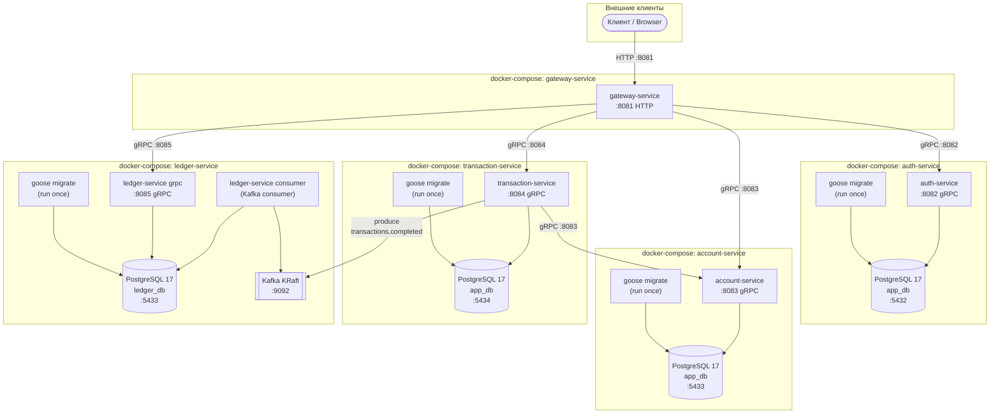

[Back to README](../README.md) · [API Reference →](api-reference.md)

# Развёртывание

Каждый сервис имеет собственный `docker-compose.yaml` в `internal/<service>/`. Стеки независимы — запускаются по отдельности (паттерн Database per Service).

---

## Топология Docker Compose стеков



> **Важно:** `account-service` и `ledger-service` оба используют хост-порт `5433` для PostgreSQL. При одновременном запуске на одной машине потребуется изменить порт одного из стеков в `docker-compose.yaml`.

---

## Команды запуска

### Локальный запуск (Docker Compose)

```bash
# Auth Service
cd internal/auth-service && make up

# Gateway Service (запускать после auth, пока он не использует другие сервисы)
cd internal/gateway-service && make up

# Account Service
cd internal/account-service && docker compose up -d

# Transaction Service
cd internal/transaction-service && docker compose up -d

# Ledger Service (gRPC + Kafka Consumer)
cd internal/ledger-service && docker compose up -d
```

### Остановка

```bash
cd internal/auth-service && make down
cd internal/gateway-service && make down
cd internal/account-service && docker compose down
cd internal/transaction-service && docker compose down
cd internal/ledger-service && docker compose down
```

### Локальный запуск без Docker

```bash
# Переменные окружения загружаются из local.env в рабочей директории

cd internal/auth-service     && go run ./main.go application
cd internal/gateway-service  && go run ./main.go application
cd internal/account-service  && go run ./main.go application
cd internal/transaction-service && go run ./main.go application

# Ledger — два отдельных процесса
cd internal/ledger-service   && go run ./main.go grpc
cd internal/ledger-service   && go run ./main.go consumer
```

---

## Порты и адреса

| Сервис | Протокол | Хост-порт | Описание |
|--------|----------|-----------|----------|
| gateway-service | HTTP | `8081` | REST API — единственная точка входа |
| auth-service | gRPC | `8082` | Аутентификация и управление пользователями |
| account-service | gRPC | `8083` | Банковские счета |
| transaction-service | gRPC | `8084` | Переводы и пополнения |
| ledger-service | gRPC | `8085` | Бухгалтерские выписки |
| auth DB | PostgreSQL | `5432` | `app_db` |
| account DB | PostgreSQL | `5433` | `app_db` |
| transaction DB | PostgreSQL | `5434` | `app_db` |
| ledger DB | PostgreSQL | `5433`* | `ledger_db` |
| Kafka | PLAINTEXT | `9092` | Топик `transactions.completed` |

> *ledger и account DB используют один хост-порт. Конфликт при одновременном запуске.

---

## Конфигурация сервисов

Каждый сервис использует два env-файла:

| Файл | Назначение |
|------|------------|
| `local.env` | Локальный запуск (`go run`), все хосты = `localhost` |
| `docker.env` | Docker Compose, хосты = имена контейнеров (`db`, `kafka`) |

Конфигурация загружается через `pkg/config.NewLoaderConfig(envFilePath, prefix).Load(&cfg)`.

Подробнее о переменных окружения → [Конфигурация](configuration.md).

---

## Сборка образов

Все `Dockerfile` находятся в `internal/<service>/Dockerfile`. Контекст сборки — корень репозитория:

```bash
# Пример: сборка auth-service
docker build -f internal/auth-service/Dockerfile -t auth-service .

# Через docker compose (из директории сервиса)
cd internal/auth-service && docker compose build
```

---

## CI

GitHub Actions запускает `golangci-lint` при push/PR в `main`.

Конфигурация: `.github/workflows/ci.yml` + `.golangci.yml` (строгий режим).

```bash
# Локальная проверка линтером
make install-lint
make lint
```

---

## See Also

- [Начало работы](getting-started.md) — быстрый старт и первые запросы
- [Конфигурация](configuration.md) — все переменные окружения
- [C4 Диаграммы](c4.md) — архитектурный контекст и топология контейнеров
