[← C4 Диаграммы](c4.md) · [Back to README](../README.md)

# Sequence Diagrams

Диаграммы последовательностей по всем 15 HTTP endpoints `gateway-service`. Каждая диаграмма отражает путь запроса через слои: `HTTP middleware → transport → service → storage → ответ`.

**Условные обозначения:**

- **Реализовано** — поток подтверждён кодом сервиса и тестируется руками.
- **`[скелет]`** — топология компонентов уже отражена в коде (`internal/<service>/internal/...`), бизнес-логика ещё дописывается; диаграмма описывает **целевой** поток.
- `rect rgb(230, 240, 255)` — транзакционная граница (`BeginFunc(ctx, fn)`), всё внутри идёт в одной БД-транзакции.
- Все межсервисные стрелки `gRPC` подразумевают инжектирование `x-trace-id` / `x-request-id` в metadata (опускаем в нотах, чтобы не дублировать).

## Содержание

### Health
- [GET /ping](#get-ping)

### Auth (`auth-service` — реализован)
- [POST /auth/login](#post-authlogin)
- [POST /auth/refresh](#post-authrefresh)
- [POST /auth/logout](#post-authlogout)

### Users (`auth-service` — реализован)
- [POST /users](#post-users)

### Accounts (`account-service` — `[скелет]`)
- [POST /accounts](#post-accounts)
- [GET /accounts/{account_id}](#get-accountsaccount_id)
- [GET /users/{user_id}/accounts](#get-usersuser_idaccounts)
- [GET /accounts/{account_id}/balance](#get-accountsaccount_idbalance)
- [PATCH /accounts/{account_id}/status](#patch-accountsaccount_idstatus)

### Transactions (`transaction-service` — `[скелет]`)
- [POST /transactions/transfer](#post-transactionstransfer)
- [POST /transactions/replenish](#post-transactionsreplenish)
- [GET /transactions/{transaction_id}](#get-transactionstransaction_id)
- [GET /accounts/{account_id}/transactions](#get-accountsaccount_idtransactions)

### Ledger (`ledger-service` — реализован)
- [GET /accounts/{account_id}/statement](#get-accountsaccount_idstatement)

---

## Health

### GET /ping

**Статус:** реализован. **Назначение:** health-check для liveness/readiness проб.

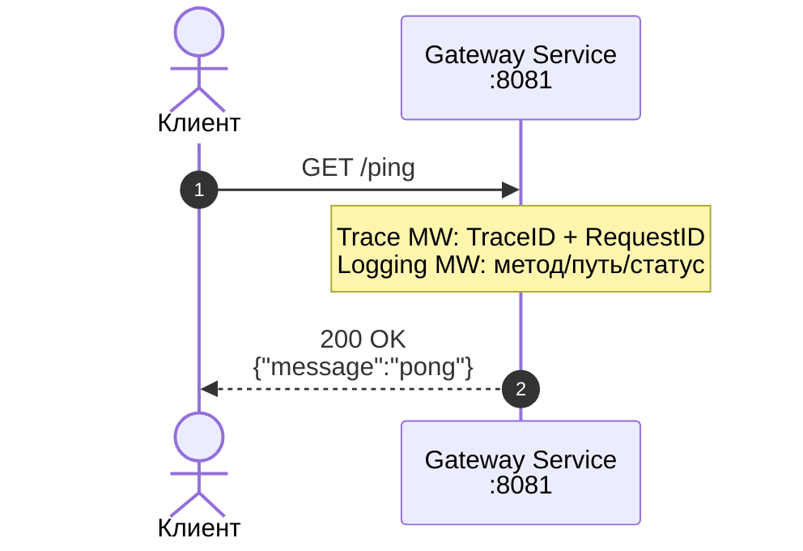

---

## Auth

### POST /auth/login

**Статус:** реализован. Аутентификация пользователя: проверка пароля, создание сессии, выдача JWT-пары.

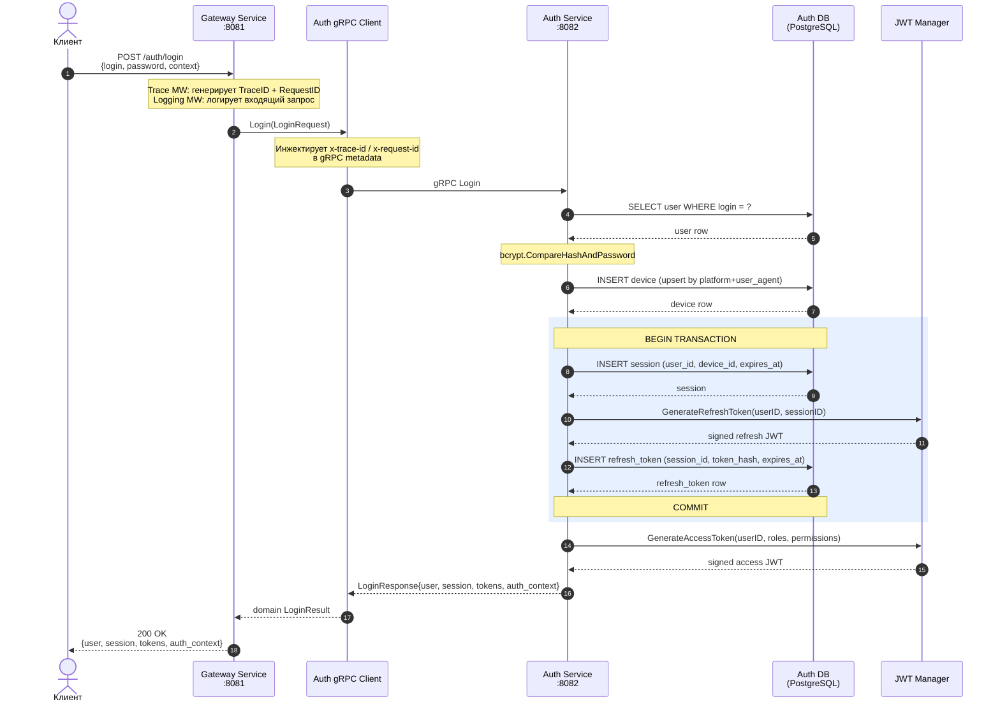

### POST /auth/refresh

**Статус:** реализован. Ротация JWT-токенов: валидация текущего refresh token, выдача новой пары.

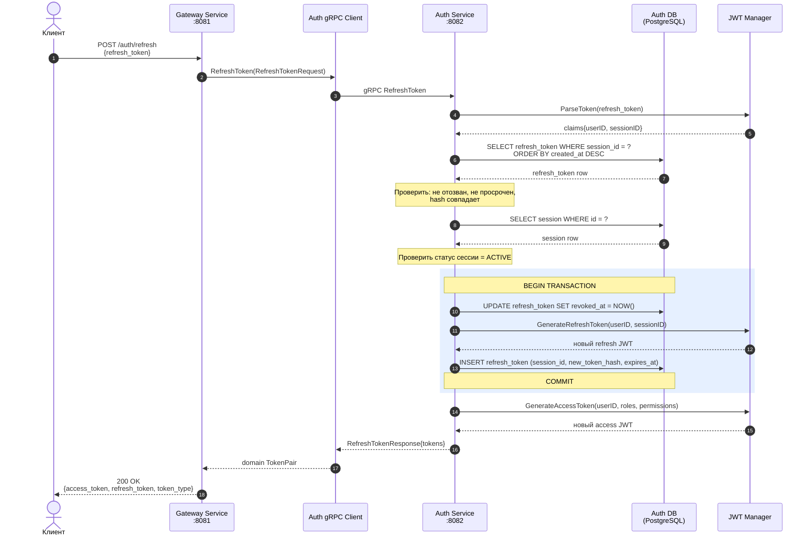

### POST /auth/logout

**Статус:** реализован. Отзыв refresh token и завершение сессии.

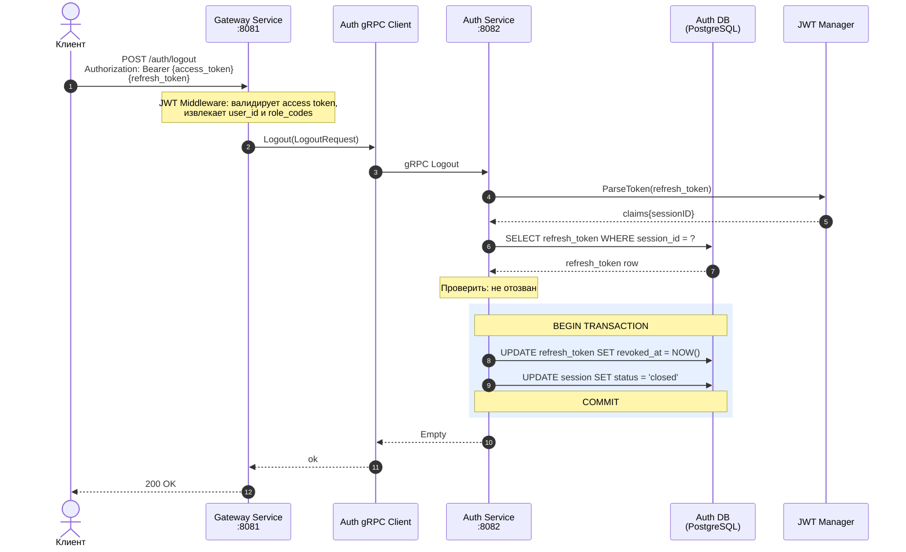

---

## Users

### POST /users

**Статус:** реализован. Создание пользователя с назначением ролей.

> Сейчас эндпоинт **не требует** JWT-токена (см. `internal/gateway-service/api/openapi.yaml`). В целевом облике перед production-ready запуском будет добавлена проверка роли `admin` / permission `users:write`. Этот шаг отмечен на диаграмме как «`TODO`».

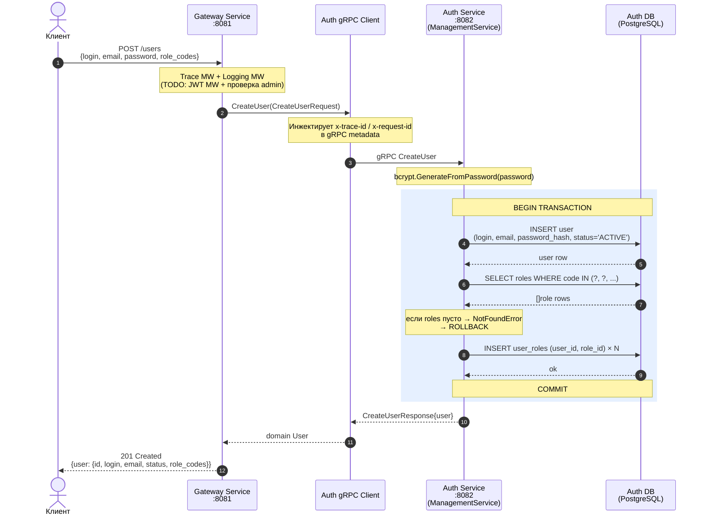

---

## Accounts

### POST /accounts

**Статус:** `[скелет]`. Открытие банковского счёта для пользователя.

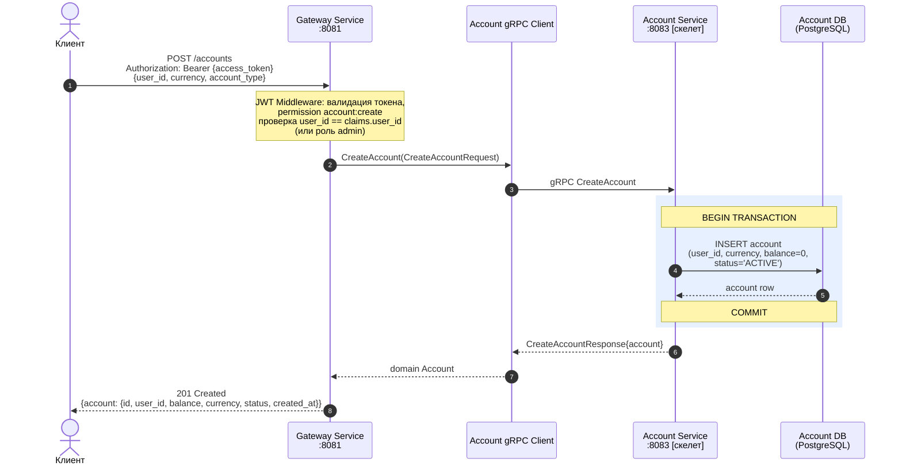

### GET /accounts/{account_id}

**Статус:** `[скелет]`. Получение одного счёта.

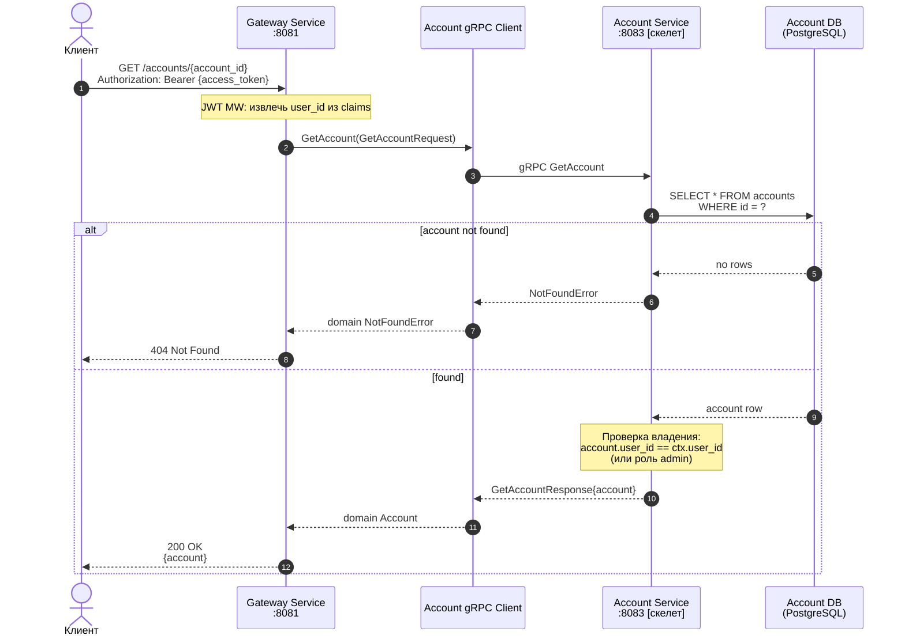

### GET /users/{user_id}/accounts

**Статус:** `[скелет]`. Список всех счетов пользователя.

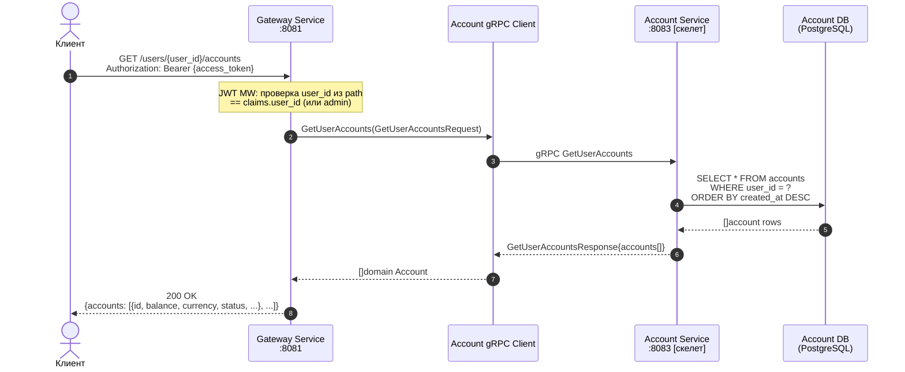

### GET /accounts/{account_id}/balance

**Статус:** `[скелет]`. Возвращает только баланс и валюту — лёгкий вариант `GetAccount` для частых проверок.

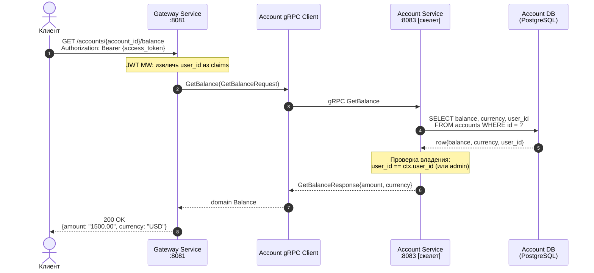

### PATCH /accounts/{account_id}/status

**Статус:** `[скелет]`. Изменение статуса счёта (admin / специальный permission).

> **Допустимые переходы:** `ACTIVE → BLOCKED`, `ACTIVE → CLOSED`, `BLOCKED → ACTIVE`. Любой другой переход → `400 Bad Request` (ValidationError).

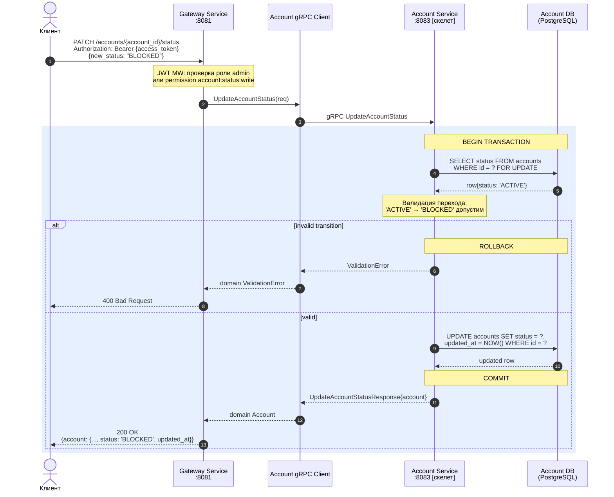

---

## Transactions

### POST /transactions/transfer

**Статус:** `[скелет]`. Создание перевода: списание с одного счёта, зачисление на другой, публикация события в Kafka, запись в бухгалтерский журнал.

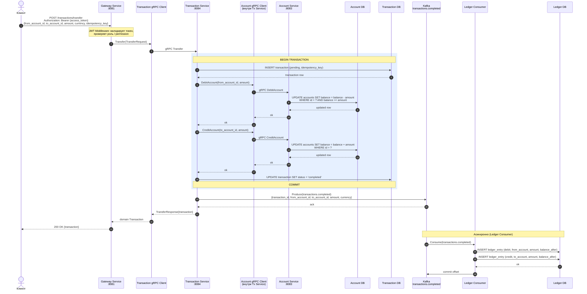

### POST /transactions/replenish

**Статус:** `[скелет]`. Пополнение счёта (одностороннее зачисление, без счёта-источника). Похоже на `transfer`, но без `Debit` и с проводкой только `credit` в ledger.

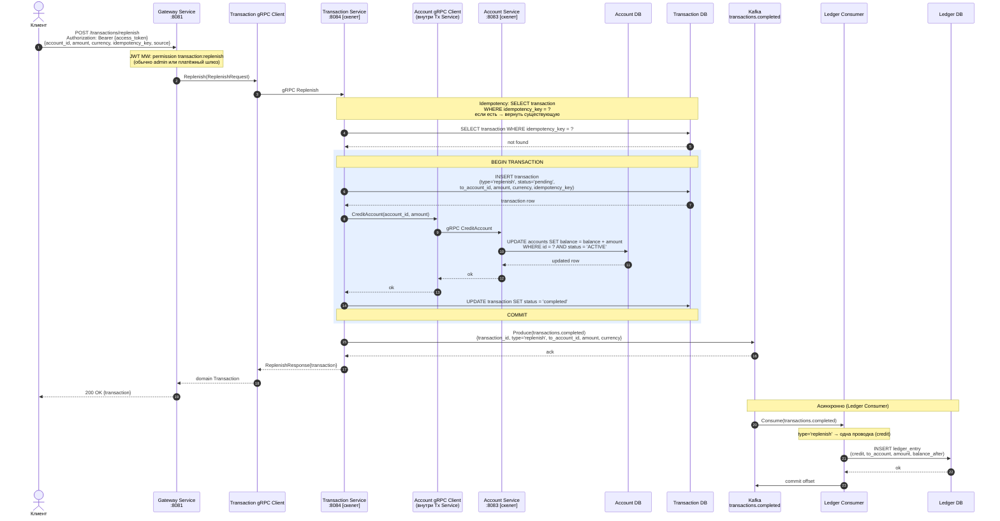

### GET /transactions/{transaction_id}

**Статус:** `[скелет]`. Получение одной транзакции по ID.

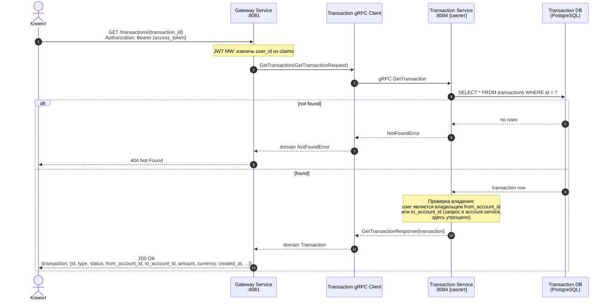

### GET /accounts/{account_id}/transactions

**Статус:** `[скелет]`. История транзакций по счёту с пагинацией.

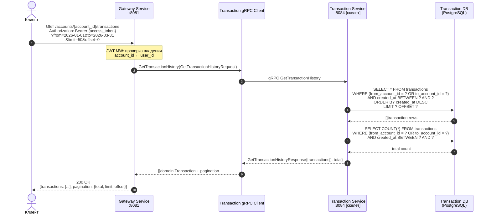

---

## Ledger

### GET /accounts/{account_id}/statement

**Статус:** реализован. Получение бухгалтерской выписки по счёту за период.

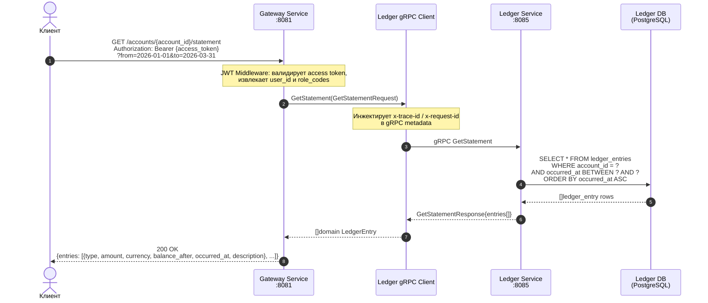

---

## See Also

- [C4 Диаграммы](c4.md) — статическая топология: Context, Container, Component
- [API Reference](api-reference.md) — HTTP и gRPC контракты
