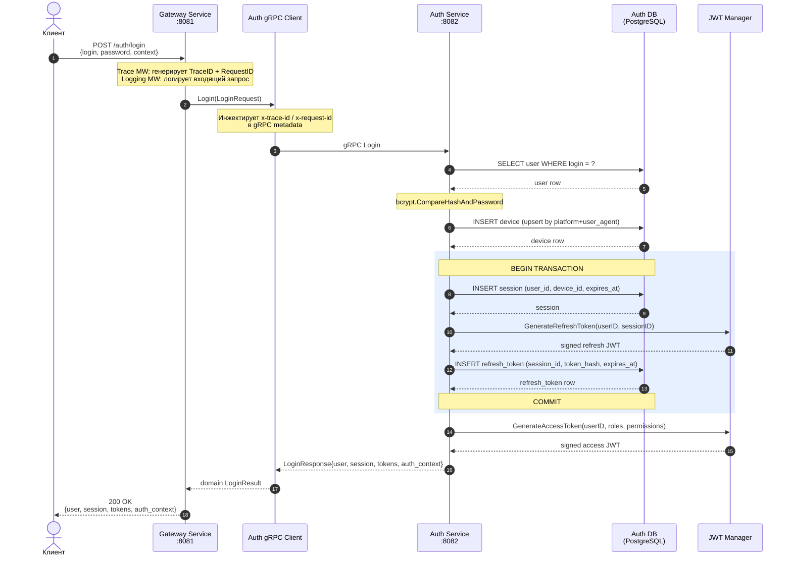
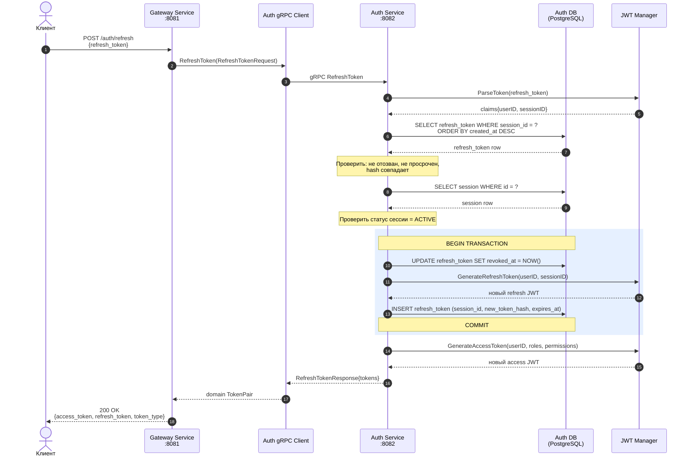
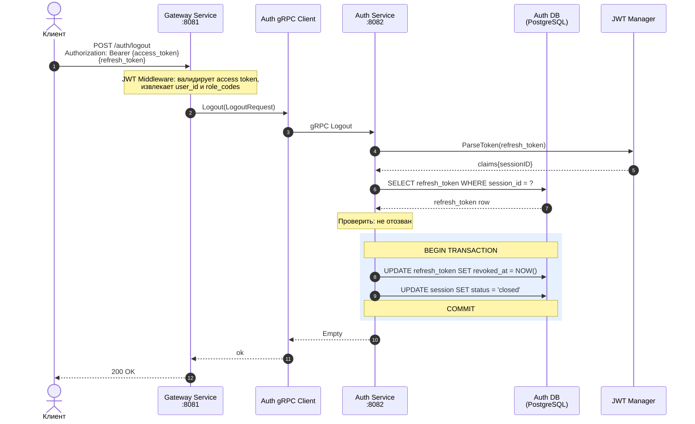
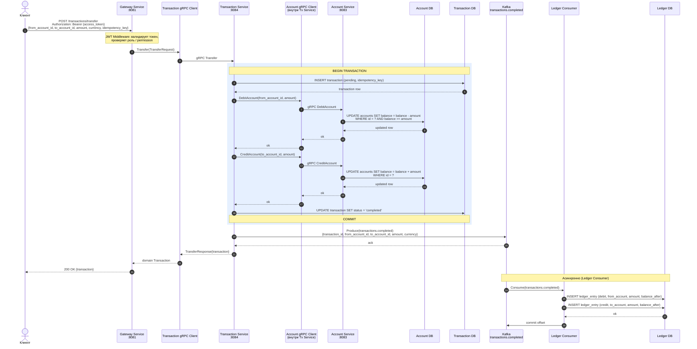
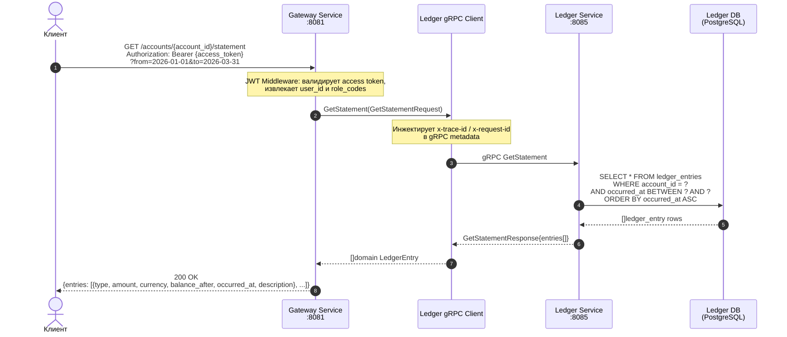

[← C4 Диаграммы](c4.md) · [Back to README](../README.md) · [База данных →](database.md)

# Sequence Diagrams

Диаграммы последовательностей ключевых use cases. Каждая диаграмма отражает реальный путь запроса через слои: HTTP middleware → transport → service → storage → ответ.

---

## Login

Аутентификация пользователя: проверка пароля, создание сессии, выдача JWT-пары.

---

## Refresh Token

Ротация JWT-токенов: валидация текущего refresh token, выдача новой пары.

---

## Logout

Отзыв refresh token и завершение сессии.

---

## Transfer (перевод между счетами)

Создание перевода: списание с одного счёта, зачисление на другой, публикация события в Kafka, запись в бухгалтерский журнал.

---

## Get Statement (выписка по счёту)

Получение бухгалтерской выписки по счёту за период.

---

## See Also

- [C4 Диаграммы](c4.md) — статическая топология: Context, Container, Component
- [База данных](database.md) — ER-схемы всех четырёх баз данных
- [API Reference](api-reference.md) — HTTP и gRPC контракты
